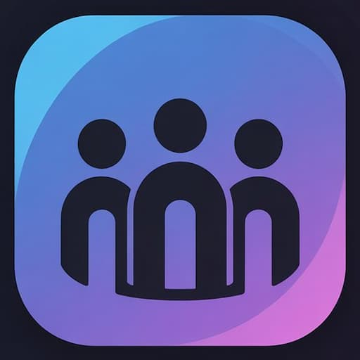

  

<h1 align="center">Ziv</h1>

  A web app to organize a congregation: territory maps, field service, meeting assignments,
  public talks, a member directory and an admin panel. Multi-congregation and installable as a PWA.

---

## Modules

| Module | What it does |
|--------|--------------|
| **Territories** | Territory maps (Leaflet + OpenStreetMap) by group, usage history, planning of field service outings, a read-only public map and a printable report. |
| **Field service** | Personal timer, monthly hours, return visits and Bible studies, goals and the group's outings for the week. |
| **Assignments** | Weekly meeting assignments (sound, microphones, attendants, reader…) with automatic rotation and a public weekly view. |
| **Life and Ministry** | Midweek meeting schedule: imports the weekly program, assigns parts with a fair rotation, auxiliary classroom, assignment slips and a public viewer. |
| **Public talks** | Incoming and outgoing speakers for the weekend meeting, speakers' outlines and circuit contacts. |
| **Directory** | Members, roles, field service groups and special weeks (circuit overseer visit, assemblies, Memorial). |
| **Admin panel** | Create and configure congregations, import territories from KML, approve users and assign roles. |

Access is role-based (Google sign-in plus manual approval by an admin); guests can use the public views.

## Stack

- Plain HTML, CSS and JavaScript: no frameworks, no build step.
- [Firebase](https://firebase.google.com/) Authentication (Google + anonymous) and Cloud Firestore.
- Hosted on GitHub Pages. Works offline as a PWA through a service worker.

## Self-hosting

1. **Clone** the repository and serve the folder with any static server (for example `npx serve .`).
2. **Create a Firebase project** and enable *Authentication* (Google and Anonymous providers) and *Cloud Firestore*.
3. **Point the app to your project:** replace the `firebaseConfig` object in `shared/firebase.js` with your own
   web app config, and add your domain to *Authentication → Settings → Authorized domains*.
4. **Security rules (required):** do not run the app with open or test-mode rules — it stores personal data.
   Copy `firestore.rules.example` to `firestore.rules` and deploy it (`firebase deploy --only firestore:rules`).
   It keeps public only the congregation list, the public map and the meeting schedules; everything else is
   limited to approved members, and each collection can only be written by the role that manages it.
5. **First admin:** sign in once with Google, then in the Firebase console edit your document in `usuarios/{uid}`
   and set `appRol: "admin_general"` and `appRoles: ["admin_general"]`. Create `config/superadmin` with a `pin`
   field to unlock `admin.html`, and create your congregation from the admin panel.
6. **Custom domain (optional):** replace the `CNAME` file with your own domain or delete it.

Firestore collections are created by the app as you use it; the main tree lives under `congregaciones/{id}/`
(groups, territories, members, assignments, meeting schedules) and per-user data under `usuarios/{uid}/`.

## Interested?

Questions, ideas or want to use it in your congregation? Open an
[issue](https://github.com/Mathwhiz/Ziv/issues).

## License

[MIT](LICENSE)

---

Ziv is an independent project and is not affiliated with or endorsed by any religious organization.
